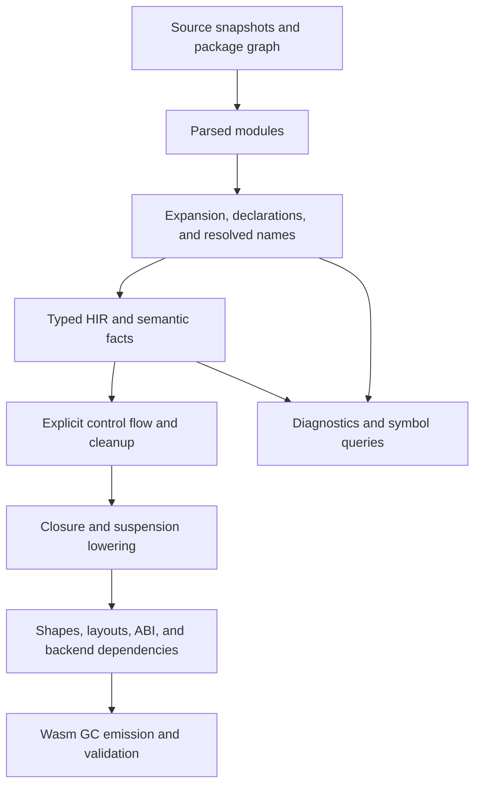

# Next Compiler: Architecture Directions

Status: recommendations for discussion, 2026-10-05. Nothing here is an owner decision or an addition to accepted language behavior.

This memo answers what architectural direction follows from the [compiler baseline](status-quo-2026-10-04.md), [checker analysis](checker-2026-10-04.md), and [emitter analysis](emitter-2026-10-04.md). Implementation evidence refers to the audited `caac922a` snapshot. Later compiler changes do not change that historical baseline.

Constraints come from the [roadmap](../../future-work/ROADMAP.md), [type system](../../spec/lang/04-type-system.md), [modules](../../spec/lang/10-modules.md), [requirements and suspension](../../spec/lang/11-requirements-and-suspension.md), and [typed derivation](../../spec/lang/14-annotations.md). The [CLI specification](../../spec/cli/README.md) and [stdlib specification](../../spec/std/README.md) define their respective behavior.

## Recommendation

Build a compiler around explicit semantic data and small passes with clear ownership. Start with batch compilation, structured types, real module identities, typed HIR, and a shared control-flow representation before Wasm generation.

The highest priority is making each important fact have an identifiable producer, lifetime, and consumer. This should reduce the amount of surrounding compiler state a change must understand.

The audit's main architectural burden is the interaction between representations and shared state. Splitting the current large files further would improve navigation without resolving those interactions.

The first implementation should keep Wasm GC as its target and expose reusable compiler APIs to commands and tools. Dependency-aware interfaces should allow later incremental evaluation, while the initial driver can run phases eagerly.

This recommendation adds compiler mechanisms only. It proposes no syntax, semantic exceptions, new intrinsics, or std APIs. Implementation language, persistent cache format, and additional targets need separate decisions.

## Evidence Behind The Priorities

These observations come from the baseline; the following sections contain proposed responses.

| Baseline evidence | Architectural consequence | Priority |
| --- | --- | --- |
| Package modules become joined source in one namespace, [CA-01](findings-2026-10-04.md#ca-01-flattened-package-identity) | Resolution, ownership, visibility, and source attribution lack a durable shared identity model. | First |
| Types are strings, [CA-02](findings-2026-10-04.md#ca-02-textual-types-and-semantic-cycles) | Many consumers must understand spelling and repeatedly recover structure. | First |
| The checker combines inherited mutable state with effectful signature lookup, [CA-03](findings-2026-10-04.md#ca-03-shared-checker-state-and-repeated-body-checks) | Inference, retries, and reuse require understanding hidden mutations. | First |
| Literal spans accumulate; diagnostic keys omit compilation identity, [CS-01](findings-2026-10-04.md#cs-01-defaulted-literal-spans-accumulate-across-compilations), [CS-02](findings-2026-10-04.md#cs-02-derivation-diagnostic-registries-reuse-keys-without-compilation-identity) | Program-dependent facts need explicit lifetimes and provenance. | First |
| HIR already contains representation choices; suspension CFG construction belongs to the emitter, [CA-04](findings-2026-10-04.md#ca-04-cross-stage-representation-and-distributed-abi) | Semantic checking, control flow, and physical layout need clearer interfaces. | Next |
| Ordinary cleanup and suspension cleanup have different generation paths, [emitter analysis](emitter-2026-10-04.md#cleanup) | Evaluation and cleanup order need a shared representation and verification strategy. | Next |
| HIR and WAT reachability cover different dependencies, [CA-06](findings-2026-10-04.md#ca-06-backend-dependency-selection-and-retention) | Backend helpers and adapters need an explicit dependency graph. | Next |

Line counts locate work, but do not measure its difficulty. The checker accounts for 56.2% of audited source lines; its dependencies make its data contracts especially consequential.

## Recommended Compiler Shape

This is a proposed responsibility map. Expansion and declaration preparation can require a worklist before semantic results are complete.

The durable representations should initially be syntax, typed HIR, and control flow. Declaration tables, resolution maps, and representation plans can be associated data instead of additional complete copies of the program.

Each boundary should state what has been resolved, what may remain symbolic, what errors are recoverable, and which component owns its output.

## 1. Give Modules, Declarations, Sources, And Types Explicit Identities

Recommendation: retain parsed files and the package/module graph throughout compilation. Resolve a name to a declaration identity before ordinary expression checking depends on it.

Use separate identities for source snapshots, modules, declarations, local bindings, and types. A declaration's identity should survive aliasing and qualification within a compilation.

An integer allocated during one compilation is not automatically a stable identity across edits or processes. Define cross-revision correspondence separately when reuse requires it.

Source locations should identify the source snapshot as well as the range. Generated declarations should retain an origin chain linking the generated node, generating declaration, and user opt-in.

Recommendation: represent types as structured values referenced by `TypeId`. Distinguish nominal declarations, applications, functions, permissions, rows, and inference variables explicitly.

Intern resolved type structures within an owned lifetime. Keep mutable inference variables in the solver; do not mutate canonical type records while trying candidates.

Formatting becomes a consumer of types and source spellings. Printed type text should have no role as a semantic lookup key.

**Tradeoff:** this requires substantial changes to interfaces and debug output. It creates a foundation for reliable equality, substitution, diagnostics, and representation planning, but is not itself a measured speedup.

**Acceptance evidence:** two modules can own distinct declarations with the same spelling; aliases resolve to the intended declaration; repeated compilations cannot share stale origin metadata.

## 2. Make The Checker A Set Of Owned Computations

Recommendation: separate declaration collection, name resolution, signature construction, obligation solving, and body checking through explicit input/output contracts.

| Component | Owns |
| --- | --- |
| Compilation context | Source snapshots, declaration/type stores, configuration, and the lifetime of semantic results. |
| Resolver | Lexical scopes, imports, visibility, and resolved declaration references. |
| Body checker | Local bindings, contextual expectations, checked expressions, and body diagnostics. |
| Solver | Inference variables, substitutions, trait/row obligations, and transactional trial state. |
| Dependency scheduler | Signature dependencies, inference cycles, and fixed-point worklists. |

Helpers should receive the relevant environment or capability explicitly. A general context should not expose every mutable registry to every expression handler.

The public result of checking a body should include typed HIR, diagnostics, and dependencies. Completed results should be immutable to downstream consumers.

Use one documented transaction protocol for candidate trials and literal retry. Private allocation buffers and mutation journals can support cheap rollback without copying the whole program.

Keeping the current strategy of checking the winner again is an acceptable initial implementation. Reusing trial HIR should wait until its local identities and obligations can be safely committed.

For requirement rows, schedule affected dependencies and mutually recursive groups explicitly. Preserve the language's existing diagnostics for forbidden result-inference cycles; a scheduler must not silently accept them.

Record obligations and their causes so an error can explain the relevant call, bound, or annotation. Recovery values can support further diagnostics, with an explicit validity gate before code generation.

**Tradeoff:** this introduces solver and scheduling interfaces. The payoff depends on keeping them small; a universal constraint framework for every language feature would create another broad subsystem.

**Acceptance evidence:** candidate order does not change the result; failed trials leave no semantic state; cyclic inference terminates according to the specification.

## 3. Give Evaluation Order And Cleanup One Control-Flow Model

Recommendation: lower typed HIR into a small control-flow IR for ordinary and suspending functions. Use explicit locals, basic blocks, operations, and terminators.

This representation should make written argument order, temporary values, branches, returns, loop exits, provider scopes, and deferred cleanup explicit.

Suspension should add pause/resume transitions to this model. Ordinary functions should use its ordinary control flow without acquiring suspension frames or polling machinery.

Preserve abstract suspension and cleanup operations until their obligations are explicit. Then perform state-machine construction and calculate the values each suspended frame must retain.

Liveness must include values needed by cancellation, deferred bodies, captured storage, and provider contexts. Considering only the normal resume path would make frame shrinking unsound.

Start with locals and straightforward dataflow analysis. SSA conversion can be introduced if later optimizations justify its implementation and maintenance cost.

**Tradeoff:** this adds a lowering pass for ordinary functions. The Wasm backend also needs a deliberate strategy for reconstructing structured control flow from the graph.

**Acceptance evidence:** named arguments evaluate in source order, returns save their values before cleanup, and cancellation follows the same cleanup obligations as other exits.

## 4. Make Representation And The Host ABI Explicit Backend Inputs

Recommendation: retain semantic types and calls in typed HIR, then compute physical layouts, callable signatures, dictionaries, boxing, and adapters in a representation layer.

The checker should determine which implementation or obligation a call uses. The representation layer should decide how that evidence travels through the generated program.

The [shape strategy](../../spec/lang/04-type-system.md#shapes-and-generic-code) already calls for specialization by value layout and shared code for reference shapes. The successor architecture must accommodate that strategy, including its fallback for unbounded value-layout instantiations.

A shape planner should track reachable instantiations, shared reference bodies, specialized value bodies, and required adapters. Keep this information separate from source-level generic inference.

The prototype's erased representation can help bootstrap a limited vertical slice. It is insufficient as the successor's completion criterion for the specified representation strategy.

Define host imports, argument/result encodings, provider operations, and failure conventions in one ABI description consumed by both emission and host integration.

Semantic identities, generated symbol indices, and replay identities need separate contracts. The [open runtime work](../../future-work/OPEN_ISSUES.md#runtime-library-abi-and-tooling-work) already records differences between prototype replay and the decided replay model.

Record runtime-helper, adapter, type, and import dependencies as backend data. Backend reachability can then select a complete module before serialization.

Retaining WAT output initially is reasonable. Replacing its structural linker becomes justified when the backend graph demonstrably covers the dependencies currently discovered there.

**Tradeoff:** representations become a substantial subsystem with its own tests and verifiers. A shared ABI description also needs a clear boundary between internal layouts and externally supported interfaces.

**Acceptance evidence:** value layouts remain unboxed where specified; selected trait operations survive adaptation; host round trips agree on encodings and failures.

## 5. Treat Generated Code And Diagnostics As Core Compiler Data

Recommendation: let derivation produce compiler declarations through typed builders, with explicit generated identities and source origins.

Generated declarations should enter the same resolution and checking rules as written declarations. Keep one derivation block per concern, following the recorded owner principle.

String-based generation can remain an initial adapter, but its result should immediately acquire the same origin and identity contracts as other declarations.

Make the expansion dependency order explicit. Derivation support, inspect declarations, and newly generated declarations can require repeated preparation before body checking.

Expose partial declaration and type results to diagnostic and symbol-query clients. A failed body should not erase unrelated declarations that tools can still describe.

Maintain both the written spelling and semantic identity needed for a diagnostic. This lets reports name user declarations without teaching each emitter or solver helper about internal naming conventions.

**Tradeoff:** builders and provenance tables cost code and memory. Their value should be demonstrated on a difficult derivation error before extending them throughout generation.

**Acceptance evidence:** a failure in generated code points to the responsible source member or opt-in, including after an edit and a second compilation.

## 6. Prepare For Incremental Use Through Interfaces

Recommendation: expose operations at useful semantic units: parse a file, resolve a module, obtain a signature, check a body, and lower a body.

Begin with deterministic eager execution and immutable completed results. Track dependencies explicitly enough to explain why a result must be recomputed.

Inputs include source, imported declarations, relevant compiler options, std definitions, and host profiles when they affect checking. A cache key cannot safely consist of source text alone.

Cross-edit reuse, persistent storage, and parallel scheduling can follow once those dependencies are correct and measured. They should share the same invalidation contract.

The owner has [deferred a checked-stdlib cache](../../future-work/compiler/goals.md) (task P4c). This recommendation does not introduce one or reopen that decision.

The roadmap's compiler-written SQL program database also remains on hold. In-process semantic APIs do not require that product or storage format.

The CLI, playground, REPL, and symbol tools should consume the same semantic APIs. This provides an early reason to make results reusable even during batch compilation.

**Tradeoff:** interfaces alone provide no incremental speedup. Explicit dependency reporting adds work before it yields reuse, so measure its cost and keep the first scheduler simple.

**Acceptance evidence:** repeated requests on unchanged inputs agree; edits invalidate dependent results; independent compilation sessions cannot contaminate each other.

## External Precedents

These precedents support individual design choices. Their size and feature sets do not establish the right complexity budget for hd.

| Precedent | Relevant mechanism | Implication for this recommendation |
| --- | --- | --- |
| [Rust MIR](https://rustc-dev-guide.rust-lang.org/mir/index.html) | A typed control-flow representation without nested expressions supports flow analysis and code generation. | Make evaluation and cleanup order explicit before generating Wasm. |
| [Rust query model](https://rustc-dev-guide.rust-lang.org/queries/query-evaluation-model-in-detail.html) | Keyed computations use immutable inputs/results and explicit dependencies; reuse relies on those properties. | Establish owned results and dependencies before introducing persistent reuse. |
| [Swift compiler architecture](https://www.swift.org/documentation/swift-compiler/) | SIL separates language-specific transformations and optimizations from LLVM IR generation. | Give hd semantics and representation choices a home above target emission. |

The hd recommendations are architectural judgments based on the audit. These sources supply precedents, not benchmarks or proof that the same tradeoffs are best for hd.

## Alternatives And Scope Control

| Direction | Benefit | Cost or limitation | Recommendation |
| --- | --- | --- | --- |
| Continue reorganizing the prototype | Fastest delivery of isolated improvements. | Existing state and representation contracts remain major constraints. | Useful for maintenance while building the successor. |
| Small staged compiler with explicit semantic data | Addresses identity, ownership, lowering, and verification together. | Requires new data contracts and adapters during migration. | Preferred foundation. |
| Incremental compiler service from the first milestone | Makes interactive reuse a primary goal. | Adds invalidation, scheduling, lifecycle, and persistence decisions early. | Consider only if edit latency is the first product requirement. |
| Minimal batch compiler with one target and no reuse across invocations | Smallest initial implementation and simplest lifetime model. | Repeats work and offers less interactive reuse. | A viable first execution model for the staged design. |

Implementation language should follow deployment and engineering needs: browser support, compiler startup, profiling, debugging, and team familiarity. The audit does not establish that changing language is the main source of improvement.

Additional backends, a general pass-plugin framework, distributed compilation, and a persistent query database need their own demonstrated use cases. They should not determine the first module boundaries.

## Suggested Build Order

The roadmap puts correctness first. The order below is a proposed implementation sequence within the successor effort, not a replacement roadmap.

| Step | Concrete deliverable | Gate before broadening |
| --- | --- | --- |
| 1. Establish identity and type contracts | Source snapshots, module/declaration IDs, structured types, provenance, and owned state. | Resolution and repeated-compilation isolation tests pass. |
| 2. Build a small executable slice | Ordinary functions plus a captured mutable local, a provider-backed suspension, and deferred cleanup through typed HIR and control flow. | Existing fixture behavior agrees with the spec, including cancellation and evaluation order. |
| 3. Expand semantic coverage | Traits, requirement rows, generic calls, defaults, and derivation through the same contracts. | Portable conformance coverage grows; each unsupported feature has an explicit gap. |
| 4. Complete representation strategy | Shape planning, layouts, dictionaries, host ABI, and backend dependency selection. | Representation rules and runtime observations hold across specialized and shared code. |
| 5. Measure and optimize | Worklists, liveness, representation improvements, and targeted reuse where authorized. | Improvements are measured against correctness, memory, latency, and code-size baselines. |

Use the existing portable command contract to run both compilers on the same fixtures. Differential disagreement is evidence to investigate; the specification decides which result is correct.

The audited passing subset excludes known failures. A successor completion gate must account for the full applicable specification and every excluded case, not inherit the prototype's exclusions silently.

Reuse useful algorithms and fixtures where their contracts fit. A temporary adapter to the old emitter may accelerate early execution, provided it isolates the old HIR representation assumptions.

Add verifiers at representation boundaries. Check resolved declaration references, completed inference obligations, valid control-flow targets, cleanup transitions, and agreement between layouts and call signatures.

Track cold CLI latency, repeated compilation, body-check counts, trial work, retained metadata, suspension-frame fields, and emitted code size. These measurements should guide optimization priorities without equating source line count with cost.

## Decisions That Would Change This Recommendation

| Owner decision | Effect on the plan | Suggested starting position |
| --- | --- | --- |
| Is the first milestone a complete batch compiler or interactive tooling? | Determines how early recovery and reuse across edits become product gates. | A batch compiler with reusable semantic APIs. |
| Must compiled libraries link independently with a stable external ABI? | Changes representation sharing, dictionary layouts, and interface serialization. | Establish semantic module boundaries first; settle binary compatibility separately. |
| How much prototype code should be reused? | Changes migration cost and adapter requirements. | Reuse tested algorithms when they fit the new contracts. |

The first concrete design exercise should define the data contracts for one body from resolution through Wasm emission. Use capture sharing, suspension, and cleanup together to test those contracts before expanding the compiler.

## Validation Scope

This memo contains implementation recommendations and a proposed architecture diagram, with no new hd programs or language rules. Its examples of operations and identities are conceptual contracts, not implemented APIs.

The baseline reports hold the measured implementation results. Benefits described here are expected architectural effects to verify during implementation; no new performance gains are claimed.
