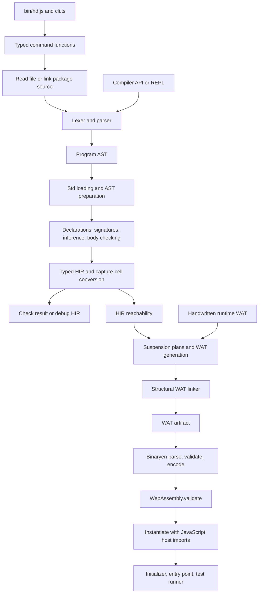

# Current Compiler: Architecture Baseline

Status: observational audit at `caac922a0041511a80e82e82b1bc4b7638a9a97f`, 2026-10-04. Nothing here is accepted language behavior or an owner decision.

This audit describes the compiler before designing its successor. It adds documents without changing the existing audit reports or compiler implementation.

The sources under review are [src/README.md](../../src/README.md), [src/KNOWN_ISSUES.md](../../src/KNOWN_ISSUES.md), and every TypeScript and WAT file under `src/`. Earlier evidence is in [opus.md](opus.md) and [perf-audit.md](perf-audit.md).

The semantic references are [the language chapters](../../spec/lang/), especially [types](../../spec/lang/04-type-system.md), [functions](../../spec/lang/07-functions.md), [traits](../../spec/lang/09-traits.md), [modules](../../spec/lang/10-modules.md), [requirements](../../spec/lang/11-requirements-and-suspension.md), and [annotations](../../spec/lang/14-annotations.md). Std APIs and command behavior remain in [spec/std](../../spec/std/README.md) and [spec/cli](../../spec/cli/README.md).

## Read This Audit

| Document | Contents |
| --- | --- |
| [Module catalog](modules-2026-10-04.md) | All 162 source files: responsibilities, main contracts, and subsystem ownership. |
| [Checker analysis](checker-2026-10-04.md) | Pass order, inference, state, dispatch, diagnostics, derivation, and HIR construction. |
| [Emitter analysis](emitter-2026-10-04.md) | Wasm layouts, code generation, suspension CFGs, linking, runtime, and host ABI. |
| [Findings and verification](findings-2026-10-04.md) | Confirmed findings, architectural risks, stale claims, commands, and evidence limits. |

## Scope And Method

The review inventories every source file and its declared surface. It reads orchestration paths and follows important algorithms through their callers and consumers.

Inspection began at `4c95e66f`. Concurrent work added `capture-view.ts` and changed capture lookup in `context.ts`; this audit incorporates those changes at `caac922a`.

Final baseline checks run on an isolated archive of `caac922a`. The archive shares installed dependencies but has separate source files, preventing later edits from changing the verification target.

The checker and emitter receive additional inspection of state mutation, lowering, representation, and execution contracts. Existing fixtures provide end-to-end traces; small JavaScript probes inspect compiler metadata without introducing new hd programs.

The import census counts static `import ... from` declarations within `src/`. It does not count re-exports, dynamic imports, browser shims, external packages, or test consumers.

This is an architecture and status audit, not an exhaustive proof of correctness. Passing selected tests establishes the selected baseline, not compliance with every specification rule.

## Size And Shape

Physical line counts include comments and blank lines. These figures measure the inspected source snapshot, not complexity or executed code.

| Area | Files | Lines | Share of all source lines |
| --- | ---: | ---: | ---: |
| `checker/` | 95 TS | 34,522 | 56.2% |
| `emitter/`, excluding runtime | 18 TS | 8,354 | 13.6% |
| `emitter/runtime/` | 1 TS + 3 WAT | 858 | 1.4% |
| `parser/` | 10 TS | 5,029 | 8.2% |
| `commands/` | 8 TS | 1,245 | 2.0% |
| Top-level `src/` | 27 TS | 11,448 | 18.6% |
| Total | 159 TS + 3 WAT | 61,456 | 100% |

There are 60,607 TypeScript lines and 849 WAT lines. Generated Unicode tables account for 1,189 lines in `script-data.ts`.

The largest units include `context.ts` (1,500), `expression-calls.ts` (1,494), `calls.ts` (1,489), and `typed-derivation.ts` (1,489). Backend hotspots include `function-body.ts` (1,429), `emitter.ts` (1,293), and `suspension.ts` (1,266).

Line count alone understates central contracts. `hir.ts`, `types.ts`, `diagnostics.ts`, `host-boundary.ts`, and the rollback helpers affect many larger consumers.

## Actual Pipeline

This diagram shows responsibilities, not independent processes. Most stages run synchronously in one JavaScript process; assembly and instantiation are asynchronous APIs.

### Stage Contracts

| Boundary | Input | Output | Important condition |
| --- | --- | --- | --- |
| `package.linkPackage` | File map, entry module, test options | Joined source, modules, initialization groups, location mapper | Module identity is largely flattened before semantic checking. |
| `parser.parse` | Source string and parse options | Optional `Program`, diagnostics | Lexical errors or parse failure prevent an AST; lexical warnings may accompany it. |
| `checker.check` | `Program`, host/entry options | Optional `HirProgram`, diagnostics | Error diagnostics prevent HIR; warnings permit it. |
| `compiler.analyze` | Source and compile options | Optional HIR, combined diagnostics | No WAT generation or Binaryen assembly. |
| `compiler.compileToWat` | Source and compile options | HIR, WAT, diagnostics | Throws `DiagnosticError` when analysis produces no HIR. |
| `emitter.emitWat` | Checked HIR, release option | Linked WAT string | Assumes coherent declaration indices, dictionary plans, and type strings. |
| `wasm.assembleWat` | WAT | WAT and binary bytes | Binaryen and the host engine both validate the result. |
| `compiler.instantiate` | Source, runtime options, optional compilation | Instance and runtime/replay handles | Resolves host providers and runs initialization. |

These APIs are in [compiler.ts](../../src/compiler.ts), [package.ts](../../src/package.ts), and each stage's `index.ts`. The compiler API itself takes one source string; package preparation belongs to its callers.

### Package Handling

[package.ts](../../src/package.ts) parses modules to resolve imports, exports, ownership checks, and initialization order. It joins reachable modules into one source string and the parser processes that string again.

The linked program uses one top-level namespace. Colliding names are rejected, and missing module isolation cannot be recovered merely by rearranging checker passes.

Package diagnostics use a segment mapper to restore physical files, lines, and columns. Std declarations use symbol-backed source origins instead.

This distinction matters for a successor: package identity, source identity, and declaration identity are three separate contracts in the current implementation.

### Frontend Handling

[lexer.ts](../../src/lexer.ts) scans identifiers, layout, delimiters, strings, interpolation, numeric tokens, and lexical diagnostics. Unicode script warnings use `unicode-scripts.ts` and generated `script-data.ts`.

The parser is handwritten recursive descent with precedence-based expression parsing. Its inheritance chain shares cursor state and diagnostic helpers across grammar files.

Parsing already performs lowering. Test registrations become synthetic test declarations and std runner calls; literal suffixes and string prefixes become calls.

Pipe expressions remain explicit AST nodes. The body checker lowers them to one-arm HIR matches, preserving single evaluation of the piped value.

The AST therefore represents parsed and partly prepared source, rather than a lossless syntax tree. Comments, trivia, and module structure are not a general persistent editing representation.

### Semantic Handling

The checker loads std source, rewrites names, expands derivations, hoists local declarations, resolves aliases, builds declarations, checks bodies, and converts captured storage. There is no separate general-purpose resolved AST between parsed `Program` and HIR.

Type information is represented as strings: `ValueType = string` in [hir.ts](../../src/hir.ts). `types.ts` parses those strings, while checker modules attach meaning and perform matching or substitution.

HIR is a structured tree with declaration indices, types, explicit calls, coercions, providers, dictionary plans, captures, and control constructs. Some lowering remains for the emitter.

### Backend Handling

The backend emits Wasm GC through WAT text. Generic storage uses erased references and boxing; trait and closure calls use generated dictionaries and adapters.

Suspension lowering creates a dedicated CFG only when a suspending body drives children. The remaining HIR is emitted through structured block and expression code.

The WAT linker removes backend declarations after HIR reachability has already selected code. These passes operate at different abstraction levels and are not interchangeable.

`release` changes checked arithmetic behavior. `assembleWat` does not invoke a general Binaryen optimization pipeline.

### Execution And Tooling

Most of [compiler.ts](../../src/compiler.ts) concerns host values, replay encoding, provider invocation, and instantiation. Its three compilation entry points occupy only a small part of the file.

The test runner compiles once and creates fresh instances for test cases. Property tests, regression storage, and snapshots add host-side services.

The REPL stores accepted input as source, recompiles the accumulated program, and reruns it. It suppresses previously displayed console lines; it does not incrementally preserve a running module.

Symbol queries use parsed modules and optionally inferred HIR information. They can answer some queries even when the project does not type-check.

## Dependency And Ownership Observations

The static census finds 745 source-to-source import declarations. Counts include explicit type-only imports; they describe syntactic dependency surfaces.

| Frequently imported module | Importing declarations |
| --- | ---: |
| `hir.ts` | 80 |
| `ast.ts` | 78 |
| `types.ts` | 78 |
| `diagnostics.ts` | 73 |
| `checker/shared.ts` | 34 |
| `numeric.ts` | 23 |
| `checker/context.ts` | 22 |
| `checker/standard-traits.ts` | 16 |

The checker has a value-import cycle connecting assignability, variance, shared helpers, map keys, literal joining, and least-common-type computation. This is an organizational dependency, not evidence of an initialization failure.

The documented public-folder boundary is also crossed. `compiler.ts` imports emitter reachability directly; four emitter imports reach checker internals.

Parser, checker, and emitter decomposition largely uses inheritance. Many files extend one progressively larger object rather than expose independent passes with explicit inputs and outputs.

The per-program context owns declaration registries and diagnostics. Function contexts own scopes, locals, captures, provider scopes, inferred rows, and closure output.

Module-level caches and registries remain outside those contexts. Some are immutable source caches; others hold program-dependent facts and require separate lifecycle analysis.

## Baseline For The Successor

The existing portable command contract is a useful comparison surface for another implementation. It can execute another compiler without importing this compiler's TypeScript.

Implementation tests protect valuable internal contracts: capture sharing, speculative rollback, reachability, generated layouts, host values, replay, and suspension state. Their assertions need review before being treated as requirements for a different architecture.

The most consequential current constraints are flattened module identity, textual types, shared checker state, backend-specific HIR details, and an ABI spread across three implementation layers. Those are observations for the next design discussion, not chosen replacement mechanisms.
